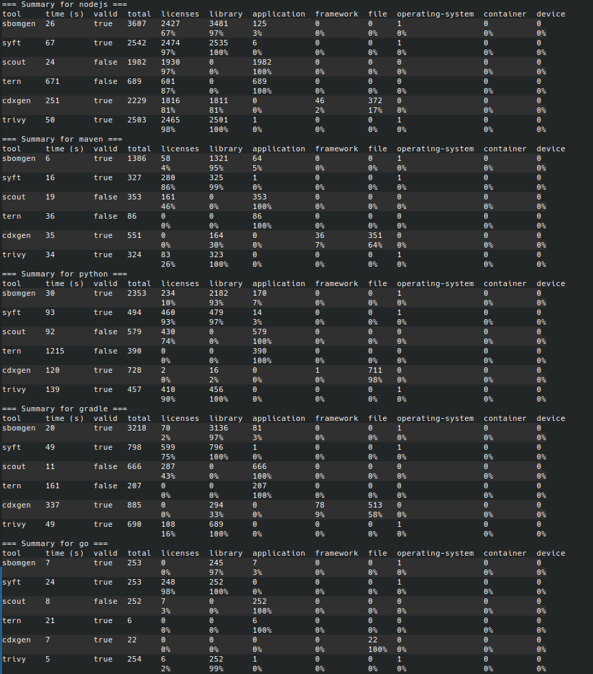

# SBOM container tools Shootout

Comparison of different tools for generating CycloneDX SBOMs for container images.

The tools are compared based on the number of identified components and licenses.
Tools that do not generate valid CycloneDX SBOMs are not investigated further.
If possible, the tools should be run from a Docker container.

The following tools are compared:

- [Syft](https://github.com/anchore/syft): CLI tool and library for generating a Software Bill of Materials (SBOM) from
  container images and filesystems. Supports multiple formats and languages.
- [Trivy](https://github.com/aquasecurity/trivy): Security scanner that detects vulnerabilities, misconfigurations,
  secrets, and generates SBOMs for containers, Kubernetes, code repositories, and cloud environments.
- [Sbomgen](https://docs.aws.amazon.com/inspector/latest/user/sbom-generator.html): Amazon Inspector SBOM Generator for
  producing SBOMs from archives, container images, directories, local systems, and compiled Go/Rust binaries. Scans for
  files containing package information.
- [Cdxgen](https://github.com/CycloneDX/cdxgen): Tool for creating CycloneDX SBOMs from source code and container
  images. Supports many languages and package managers.
- [Docker scout](https://github.com/docker/scout-cli): Docker's tool for analyzing images, dependencies, and
  vulnerabilities.
- [Tern](https://github.com/tern-tools/tern): Software composition analysis tool and Python library that generates SBOMs
  for container images and Dockerfiles, showing a layer-by-layer view of contents.

You can find how each tool was executed at the top of [shoot.bash](shoot.bash) file.

The following container images are analyzed:

- Maven: `dependencytrack/apiserver:4.13.4`
- Gradle: `library/elasticsearch:8.17.10`
- Go: `tykio/tyk-gateway:v5.8`
- Node: `library/ghost:6.0.5`
- Python: `tensorflow/tensorflow:2.20.0-jupyter`

# Results

Results can be found in the `out` folder.
You can also re-run the tests by executing `./sample.sh`.

If you want to analyze a single image use `./shoot.sh <image>`.

## Result summary



## Syft

Syft identifies the most components of all tools.
It also identifies the most licenses for the found components.

## Trivy

Trivy identifies a little less components than Syft.
Trivy does well identifing licenses for Python and Node packages,
but only identifies a few licenses for Java or Go packages.

Latest Trivy version (0.65.0) has a [bug](https://github.com/aquasecurity/trivy/issues/9300)
causing it to generate invalid CycloneDX SBOMs.
Version 0.64.1 was used for this comparison.

## Sbomgen

Sbomgen is significantly faster than the other tools.

Sbomgen generates multiple entries for a single component.
This inflates the component count with duplicate entries.

E.g. Sbomgen treats Maven metadata files (pom.xml, pom.properties) as individual
components. For logback-classic it would generate 5 components:

```
/opt/owasp/dependency-track/dependency-track-apiserver.jar/META-INF/maven/ch.qos.logback/logback-classic/pom.properties
/opt/owasp/dependency-track/dependency-track-apiserver.jar/META-INF/maven/ch.qos.logback/logback-classic/pom.xml
/opt/owasp/dependency-track/dependency-track-apiserver.jar/WEB-INF/lib/logback-classic-1.5.18.jar
/opt/owasp/dependency-track/dependency-track-apiserver.jar/WEB-INF/lib/logback-classic-1.5.18.jar/META-INF/maven/ch.qos.logback/logback-classic/pom.properties
/opt/owasp/dependency-track/dependency-track-apiserver.jar/WEB-INF/lib/logback-classic-1.5.18.jar/META-INF/maven/ch.qos.logback/logback-classic/pom.xml
```

It generates invalid PURLs for some of those entries, e.g. `pkg:maven/logback-classic@1.5.18`

It also generates multiple entries for different versions of the same component,
even though only one version is actually present in the container.

```
ch.qos.logback:logback-classic  1.2.0
ch.qos.logback:logback-classic  1.2.13
ch.qos.logback:logback-classic  1.3.14
ch.qos.logback:logback-classic  1.5.18
ch.qos.logback:logback-classic  1.5.6
```

Sbomgen is not open source, and there seems to be no way to report issues or
request features (execept maybe via AWS support).

## Docker scout

Docker scout does not generate a [valid CycloneDX SBOM](https://github.com/docker/scout-cli/issues/190).

## Cdxgen

Cdxgen identifies the least number of components of all tools (except for Maven, where Tern does worse).
It usually generates a lot of `file` components, which are not useful for license compliance or vulnerability detection.

Cdxgen seems unable to indetify licenses for any packages other than Node packages.
Trying to use `FETCH_LICENSE=true` or `--profile license-compliance` result in empty BOM.

Cdxgen docker image is [unable to scan images](https://github.com/CycloneDX/cdxgen/issues/2205).
You are forced to use a local installation (which in turn requires installing its multiple dependencies).

Overall cdxgen looks to be the least user-friendly tool (e.g. quirky argument parsing,
having to use an explicit option for it to return non-zero exit code on failure).

## Tern

Tern does not generate a valid CycloneDX SBOM.
It also takes about 10 times as long as the other tools, e.g. it took ~20 minutes to analyze the python image.

Docker image for tern [does not build correctly](https://github.com/tern-tools/tern/issues/1256).
There is an option to use `scancode`, but I was unable
to [get it working](https://github.com/tern-tools/tern/issues/1258).
